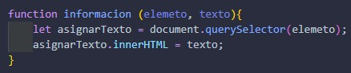
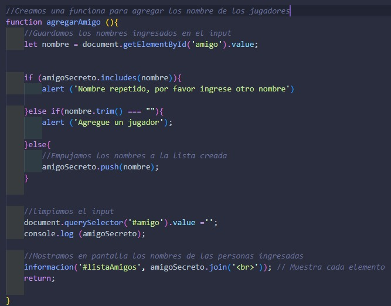
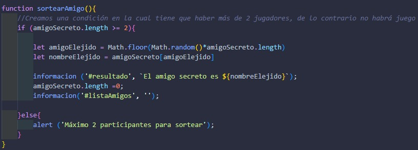

# challenge-amigo-secreto
Es un juego en donde ingresa el nombre de mínimo 2 personas y los nombres serán sorteados para elegir uno.

# Como Jugar
1. Debes ingresar uno por uno los nombres de los amigos que van a participar en el recuadro y después dar clic al botón "Agregar".

  

2. Cuando ya tenga la cantidad de amigos deseada mínimo 2 nombres, le damos clic al botón "Sortear amigo" y nos arrojara el nombre del amigo sorteado.

# Explicación del código y funcionalidad
|-En esta imagen creamos una function para colocar texto en las etiquetas de texto de una forma más rápida, sin tanto código, solo escribimos la function y dentro de los paréntesis asignamos los elementos que necesita la function.

|-Creamos esta function con la cual agregamos a los amigos que van a participar, pero no solo agrega también tiene otras indicaciones para que sea entendible el juego:

1.  tiene una variable llamada "nombre" en donde se almacenara la información escrita en el input.
2. Creamos una condición "if" para decirle al jugador cuando no ha ingresado los amigos o estén repetidos utilizando el metodo ".includes()".
3. Tenemos un "document.querySelector" para limpiar el input cada vez que se agregue el nombre de un amigo.
4. Utilizamos la function "informacion()" para mostrar los nombres de los amigos que participaran.

|-Creamos otra function para el sorteo de los amigos, en el cual tiene un condicional "if" en donde preguntara, si tiene más de 2 participantes sortee los nombre utilizando "Math.floor" y "Math.random", ademas muestre que fue el nombre sorteado y limpie la lista de los amigos, pero si no tiene la cantidad de nombres requerido muestre un alert para indicar que faltan nombres.

